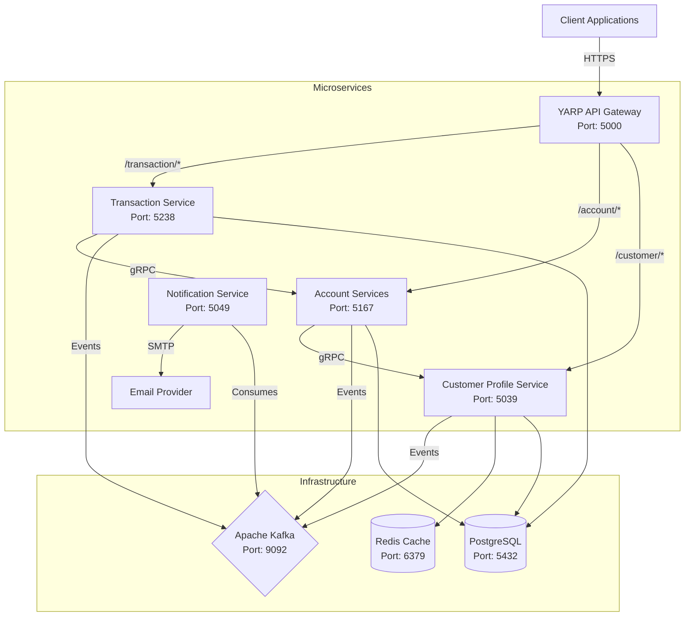

# Core Banking Software

A comprehensive, microservices-based banking solution built with **.NET 10** and **Aspire**, featuring a modern architecture designed for scalability, performance, and reliability.

## 🏗️ Architecture Overview

The solution employs a microservices architecture orchestrated by **YARP (Yet Another Reverse Proxy)** as the API Gateway. Services communicate synchronously via **gRPC** and asynchronously via **Apache Kafka**.



## 🚀 Services Breakdown

| Service | Port (Container/Host) | Description | Technology |
|---------|-----------------------|-------------|------------|
| **YARP API Gateway** | `8080` / `5000` | Entry point for all external traffic. Handles routing, load balancing, and rate limiting. | .NET 10, YARP |
| **Customer Profile** | `8080` / `5039` | Manages user identity, onboarding, biometric verification (FaceAI), and auth (JWT). | .NET 10, Postgres, Redis |
| **Account Services** | `8080` / `5167` | Core banking operations: account creation, balance management, and status tracking. | .NET 10, Postgres, gRPC |
| **Transaction Service** | `8080` / `5238` | Handles funds transfer, standard & instant payments, and orchestrates transaction sagas. | .NET 10, Postgres, Kafka |
| **Notification Service** | `8080` / `5049` | Listens to Kafka events to send SMS/Email alerts to customers. | .NET 10, Kafka, MailKit |

## 🛠️ Technology Stack

- **Framework**: .NET 10 
- **Orchestration**: .NET Aspire & Docker Compose
- **API Gateway**: YARP
- **Databases**: PostgreSQL (Primary data store), Redis (Distributed Caching)
- **Messaging**: Apache Kafka (Event-driven communication)
- **Communication**: gRPC (Inter-service), REST (External API)
- **Authentication**: JWT Bearer Tokens, Identity
- **Observability**: OpenTelemetry, Serilog

## 🚦 Getting Started

### Prerequisites

- **.NET 10 SDK**: [Download here](https://dotnet.microsoft.com/download/dotnet/10.0)
- **Docker Desktop**: Required for running containers.
- **PostgreSQL**: Local install or via Docker.

### 1. Clone the Repository

```bash
git clone https://github.com/amaechijude/CoreBankinSoftware.git
cd CoreBankingSoftware
```

### 2. Environment Setup

Copy `.env.example` to `.env` (if available) or configure `appsettings.json` in each service.
Ensure Docker is running.

### 3. Run the Solution

You have two options to run the project:

#### Option A: Using .NET Aspire (Recommended for Dev)

If you have the Aspire workload installed:

```bash
cd CoreBankingSoftware.AppHost
dotnet run
```
This will launch the **Aspire Dashboard**, allowing you to view logs, metrics, and traces for all services.

#### Option B: Using Docker Compose (Recommended for Local/Test)

Build and start all services, including infrastructure (Postgres, Redis, Kafka):

```bash
docker-compose up --build
```

Access the services:
- **API Gateway**: `http://localhost:5000`
- **Customer Swagger**: `http://localhost:5039/swagger` (or `/scalar/v1`)
- **Account Swagger**: `http://localhost:5167/swagger`

### 4. Database Migrations

After starting the services (especially Postgres), apply migrations:

```bash
# Customer Profile
cd CustomerProfile/src/CustomerProfile.API
dotnet ef database update

# Account Services
cd AccountServices
dotnet ef database update
```

## 🧪 Testing

Run unit and integration tests:

```bash
dotnet test
```

## 🔧 Configuration

Key configuration settings can be found in `appsettings.json` or overridden via Environment Variables:

- `ConnectionStrings__DefaultConnection`: PostgreSQL connection string.
- `Kafka__BootstrapServers`: Kafka broker address (default: `localhost:9092` or `kafka:9092`).
- `Redis__ConnectionString`: Redis connection string.
- `JwtSettings__Secret`: Secret key for token generation.

---
**Core Banking Software** - Built for modern financial needs.
